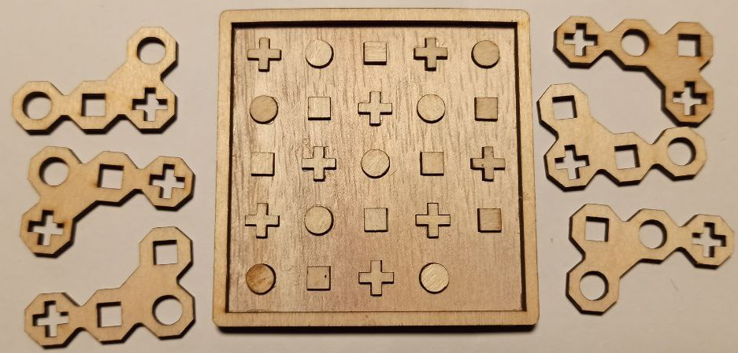
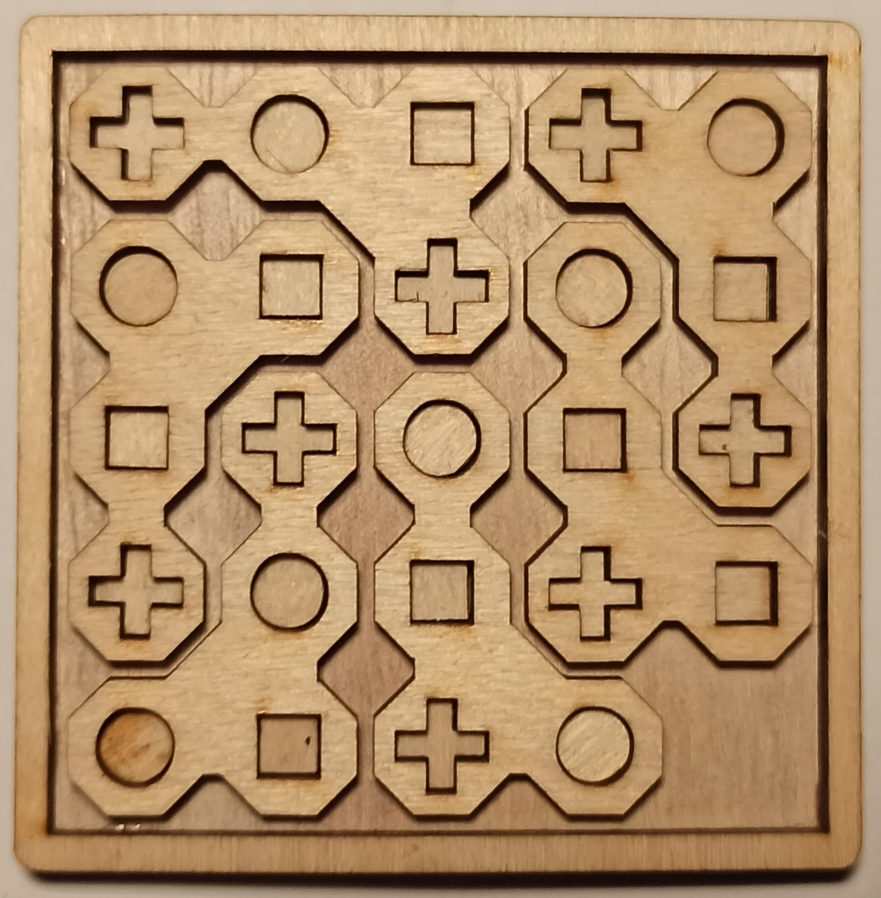
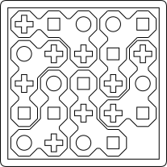
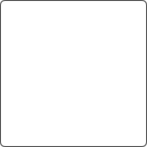
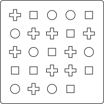

# Riddle Generator

This tool generates riddles from predefined parameters, that have only one solution and are somewhat decent. Additionaly to that, the riddles are stored in svg files, that can then be used for laser cutting.




# Python execution
## Requirements
For the python execution python, pip and venv are needed.

Prepare the virtual environment with
```bash
python3 -m venv .venv
source .venv/bin/activate
pip install -r requirements.txt
deactivate
```
## Run
### Config
Adjust the config.json file. Here is an example config that would generate riddles on a 5x5 square with 6 'L' shaped pieces:
```json
{"riddle_name": "Standard_L_0", 
"dimensions": {"x": 5, "y": 5}, 
"tiles": [
    [[3, 0, 0],
     [2, 1, 3]], 

    [[1, 0, 0], 
     [3, 1, 2]], 

    [[1, 0, 0], 
     [3, 2, 1]], 

    [[2, 0, 0], 
     [3, 1, 2]], 

    [[2, 0, 0], 
     [3, 2, 1]], 

    [[2, 0, 0], 
     [1, 3, 2]]]}
```
The numbers translate as follows:
```
1 -> square
2 -> cross
3 -> circle
```

### ENVIRONMENT
Adjust the .env file:
```env
CONFIG_FILE=config.json
INPUT_PATH=./
OUTPUT_PATH=./output/
OUTPUT_SVG_SUBFOLDER=svg
```

### Execution
Execute the python tool:
```bash
source .venv/bin/activate; python src/main.py ; deactivate
```

## Output
The result consists of three svg files, which can be used to lasercut the riddle out of plywood.






# Parallelized docker execution

## Requirements
For the python execution python, pip, venv, docker, docker compose and make are needed.
Prepare the virtual environment with
```bash
python -m venv .venv
source .venv/bin/activate
pip install -r requirements.txt
deactivate
```

Build the docker image with
```bash
make build
```

## Run
Adjust the experiment config. It is basicly a list of configs described in [Config](#config)
```json
[
 {"riddle_name": "Standard_L_0", "dimensions": {"x": 5, "y": 5}, "tiles": [[[3, 0, 0], [2, 1, 3]], [[1, 0, 0], [3, 1, 2]], [[1, 0, 0], [3, 2, 1]], [[2, 0, 0], [3, 1, 2]], [[2, 0, 0], [3, 2, 1]], [[2, 0, 0], [1, 3, 2]]]},
 {"riddle_name": "Standard_L_1", "dimensions": {"x": 5, "y": 5}, "tiles": [[[2, 0, 0], [1, 2, 3]], [[1, 0, 0], [3, 1, 2]], [[1, 0, 0], [3, 2, 1]], [[2, 0, 0], [3, 1, 2]], [[2, 0, 0], [3, 2, 1]], [[2, 0, 0], [1, 3, 2]]]}
]
```
The .env file can remain untouched.

In the main of the DockerOrchestrator.py, set the `input_config_path` to the path of your experiment config.
Then start the docker orchestrator using:
```bash
source .venv/bin/activat; python DockerOrchestrator.py; deactivate
```
## Output

The result will be a folder with the following structure:
```
└── experiments
    ├── ${ExperimentName1}_${x-Dimension}x${y-dimension}
        ├── input
            └── ${ExperimentName1}.json
        └── output
            ├── stl
                ├── 0_${difficulty}_riddle.svg
                ├── 0_${difficulty}_tiles_backplate.svg
                ├── 0_${difficulty}_tiles_tiles.svg
                ├── ...
            └── ${ExperimentName1}.db
    ├── ${ExperimentName2}_${x-Dimension}x${y-dimension}
        ...
    ...
```